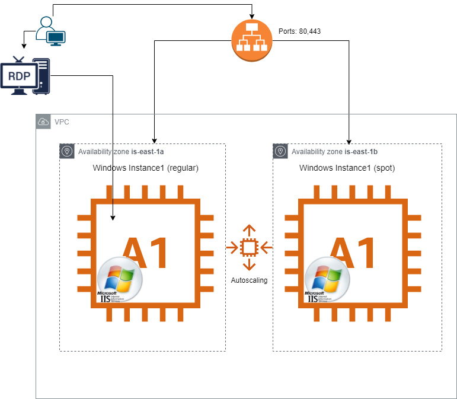
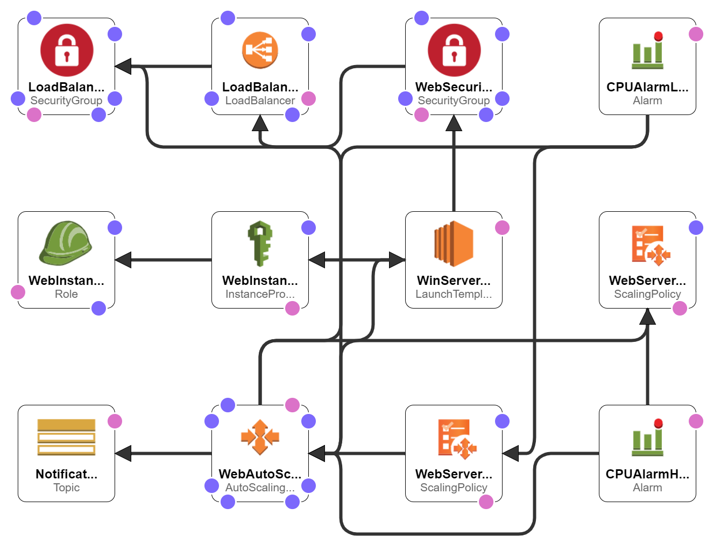

# Cloudformation hight availability mixed node's (demand and spot) bootstrapped  Windows instances with autoscaling and alarm
This cfn template bring up 2 Windows instances with IIS in 2 different AZ's. <br>
One instance is regular `On-Demand` and the second is `Spot`.<br>
After while, we got trigger `CPUAlarmLow`. As result, the spot instance will be removed from the AutoscalingGroup.<br>
Notification will be send to provided e-mail.<br>
- CPUAlarmHigh Threshold > 90% 
- CPUAlarmLow Threshold  < 70%
<p align="center" width=350 height=350> 

</p>


## Setup
================
## Vpc (vpc.yaml)
VPC with private and public subnets in two Availability Zones
<p align="center" width=350 height=350> 

</p>

## Stack (stack.yaml)
<p align="center" width=350 height=350> 

</p>

# ToDo
- Setup SSL listener
- Limit RDP access. (Lets say from VPN only)
- Security:
    - Allow access only from VPN 
    - Policy?
- If we want to implement additional health check from instance against ELB to check if all instances in service, we need:
    - Add `ElasticLoadBalancingReadOnly` to  `WinTest-WebInstanceRole`
    - enable `verify_instance_health` section in template
- Change classic LB to New ?


### Ami 
Currently, AMI hardcoded in the template, here is probably better way to do that. <br>
Commands to find AMI's:
```
aws --region us-east-1 ec2 describe-images --owners amazon --filters 'Name=name,Values=Windows_Server*' 'Name=state,Values=available' --output json | jq -r '.Images |   sort_by(.CreationDate) | last(.[]).ImageId'
```
```
aws --region us-east-1 ec2 describe-images --owners amazon --filters 'Name=name,Values=Windows_Server-2019-English-Core*' 'Name=state,Values=available' --query 'sort_by(Images, &CreationDate)[].Name'
```
```cmd
aws --region us-east-1 ec2 describe-images --owners amazon --filters 'Name=name,Values=Windows_Server-2019-English-Core-Base*' 'Name=state,Values=available' --output json | jq -r '.Images |   sort_by(.CreationDate) | last(.[]).ImageId'
```

```cmd
export ami_id=$(aws --region us-east-1 ec2 describe-images --owners amazon --filters 'Name=name,Values=Windows_Server-2019-English-Core-Base*' 'Name=state,Values=available' --output json | jq -r '.Images |   sort_by(.CreationDate) | last(.[]).ImageId')
```
```bash
aws --region us-east-1 ec2 describe-images --owners amazon --filters 'Name=name,Values=Windows_Server-2019-English-Core*' 'Name=state,Values=available' --query 'sort_by(Images, &CreationDate)[].Name'
```
```
aws --region us-east-1 ec2 describe-images --owners amazon --filters 'Name=name,Values=Windows_Server-2019-English-Core-Base*' 'Name=state,Values=available' --query 'sort_by(Images, &CreationDate)[].ImageId'
```

